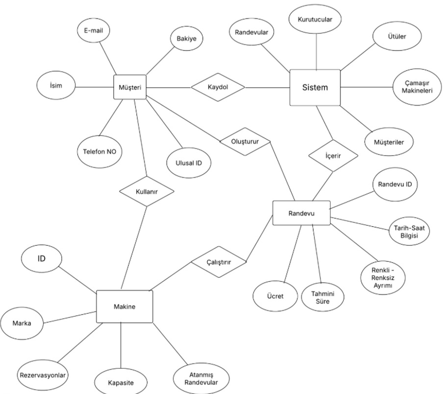
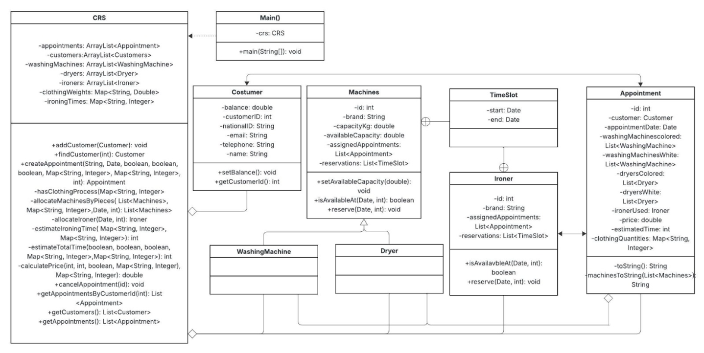
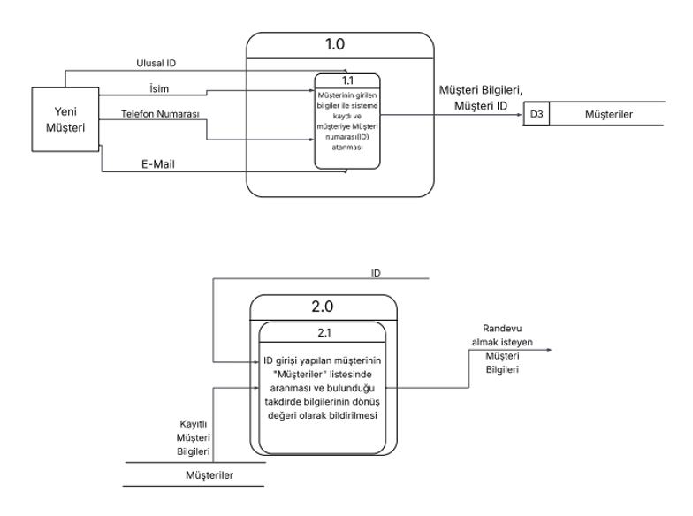
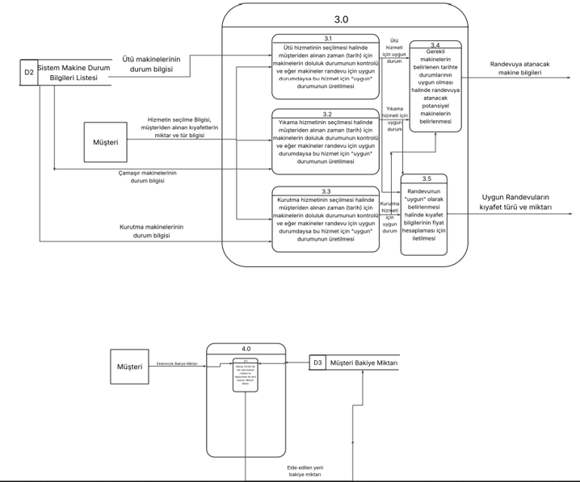
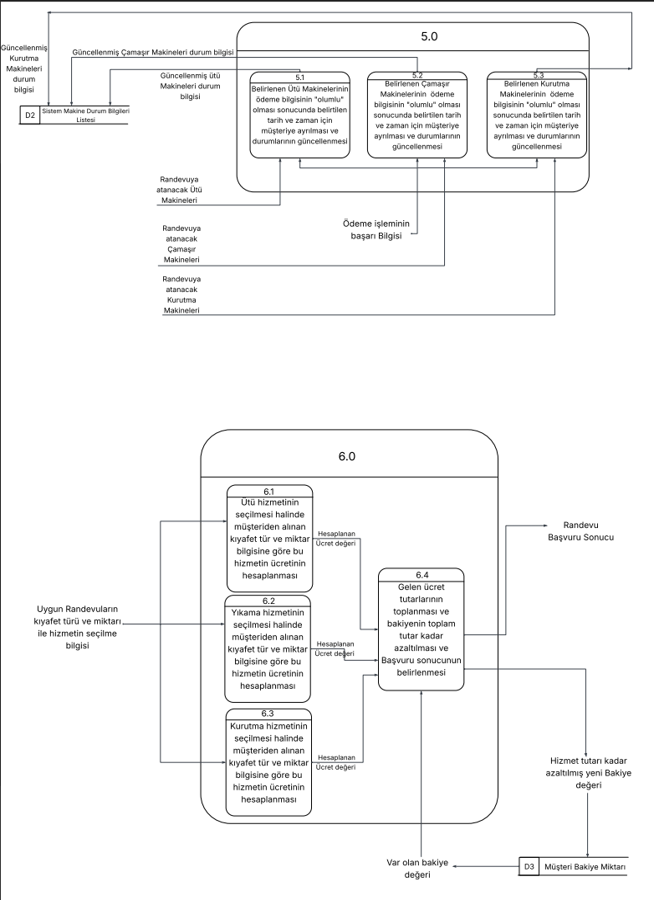
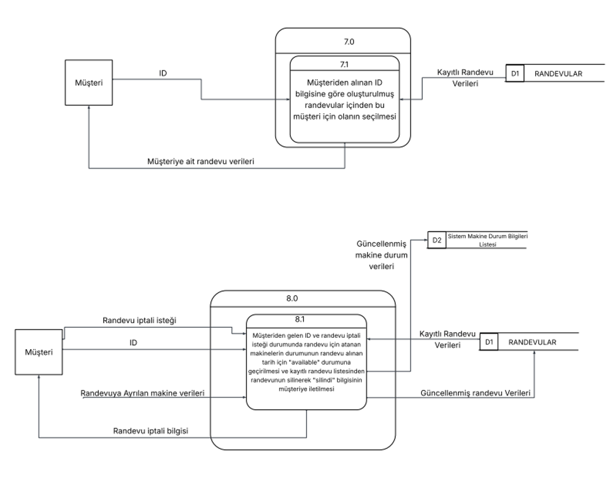
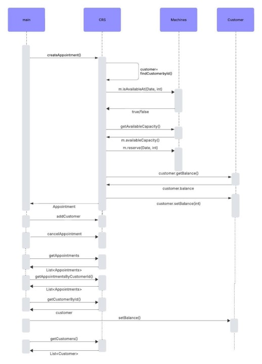

# 🧺 Laundry Reservation & Management System (Java) 

Bu proje, geleneksel ve manuel çamaşırhane süreçlerini dijitalleştirmek amacıyla geliştirilmiş, masaüstü tabanlı ve nesne yönelimli (OOP) bir otomasyon sistemidir. Sadece bir kodlama projesi olmanın ötesinde; gereksinim analizi, fizibilite etüdü ve uçtan uca sistem mimarisi (SDLC) tasarımı süreçlerini barındıran kapsamlı bir yazılım mühendisliği uygulamasıdır. 

Sistem geliştirilirken yazılım yaşam döngüsü modellerinden **Şelale (Waterfall) Modeli** temel alınmıştır. 

## 🚀 Öne Çıkan Özellikler

* **Self-Servis Müşteri Yönetimi:** Kullanıcı kaydı, benzersiz ID ataması ve dinamik bakiye takibi.
**Akıllı Rezervasyon Algoritması:** Seçilen kıyafet türüne (T-Shirt, Gömlek, Pantolon vb.) ve miktarına göre ağırlık hesaplaması yapılarak, uygun kapasitedeki çamaşır ve kurutma makinelerinin (Renkli/Beyaz ayrımıyla) otomatik tahsis edilmesi.
**Dinamik Fiyatlandırma ve Süre Tahmini:** Kullanılan makine sayısına ve ütüleme işlemine göre toplam ücretin ve tahmini işlem süresinin dinamik hesaplanması.
**Harici Veritabanı Bağımsızlığı:** Veri kalıcılığı (Data Persistence), Java Object Serialization kullanılarak doğrudan dosya sistemi (`.dat` uzantılı dosyalar) üzerinden sağlanmıştır.
**Kullanıcı Dostu Arayüz:** Tüm işlemler Java Swing kütüphanesi ile geliştirilen masaüstü arayüzü (GUI) üzerinden kontrol edilmektedir.

## 🛠️ Sistem Analizi ve Mimari Tasarım

Projenin en güçlü yönlerinden biri, kodlamaya geçilmeden önce kapsamlı bir mimari tasarım sürecinden geçmiş olmasıdır. Aşağıdaki diyagramlar, sistemin altyapısını oluşturmaktadır:

*(Not: Aşağıdaki diyagramları görüntülemek için repodaki `images` klasörünü inceleyebilirsiniz.)*

### 1. Varlık İlişki Diyagramı (ER Diagram)
Müşteriler, Makineler (Çamaşır, Kurutma, Ütü) ve Randevular arasındaki veri ilişkileri ve kardinaliteler modellenmiştir.

### 2. UML Sınıf Diyagramı (Class Diagram)
Sistemdeki sınıfların kalıtım (Inheritance), kapsülleme (Encapsulation) ve çok biçimlilik (Polymorphism) gibi OOP prensiplerine uygun olarak nasıl yapılandırıldığı gösterilmektedir.

### 3. Veri Akış Diyagramları (DFD)
Kullanıcının sisteme girişinden randevu oluşturma ve makine durumu güncelleme adımlarına kadar olan veri akışı detaylı olarak analiz edilmiştir.

**Bölüm 1:**

**Bölüm 2:**

**Bölüm 3:**

**Bölüm 4:**

### 4. Ardışıl Diyagram (Sequence Diagram)
Bir randevu oluşturma işleminin (Appointment Creation) nesneler ve fonksiyonlar arasındaki zaman sırasına göre çalışma mantığı detaylandırılmıştır.

## 💻 Kullanılan Teknolojiler

**Programlama Dili:** Java (JDK)
**Arayüz Geliştirme:** Java Swing, AWT
**Mimari Yaklaşım:** Object-Oriented Programming (OOP)
**Veri Depolama:** File I/O & Serialization (`.dat` ve `.txt` formatları)
**Hata Yönetimi:** Özelleştirilmiş Exception Sınıfları (`IDException`, `NoAvailableMachine`, `YetersizBakiye`)

## ⚙️ Kurulum ve Çalıştırma

Projeyi yerel makinenizde çalıştırmak için:
1. Repoyu klonlayın: `git clone https://github.com/oytunutkan/laundry-reservation-system.git`
2. Tercih ettiğiniz IDE (IntelliJ IDEA veya Eclipse) ile projeyi açın.
3. `Main.java` dosyasını çalıştırarak arayüze erişim sağlayın. Veriler `appointments.dat`, `customers.dat` vb. dosyalar üzerinden otomatik olarak yüklenecek ve saklanacaktır.
